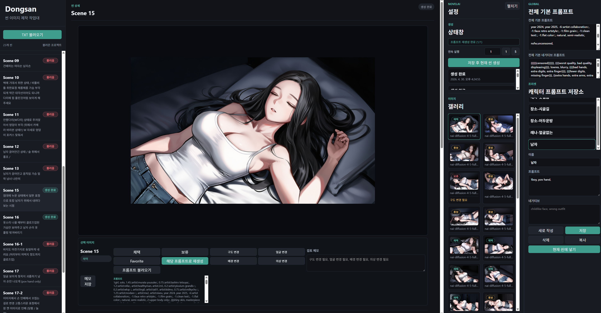
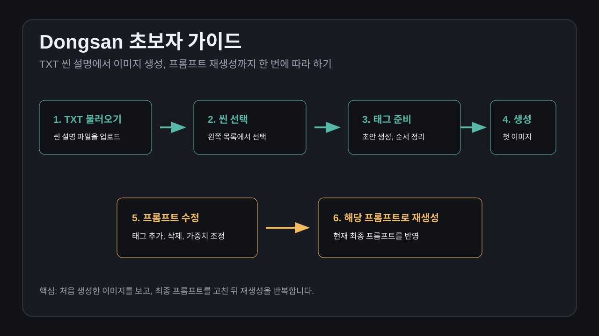
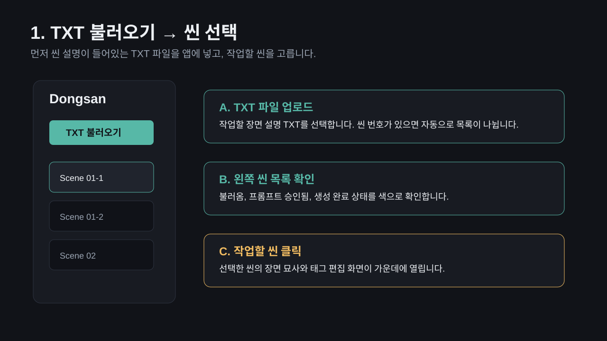
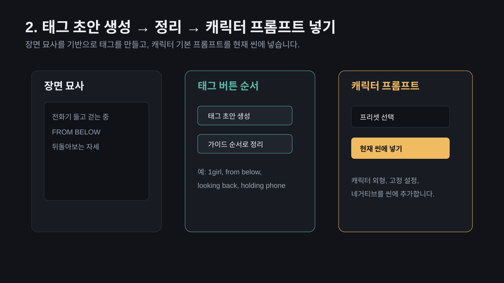
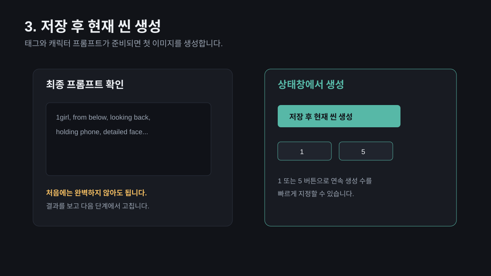
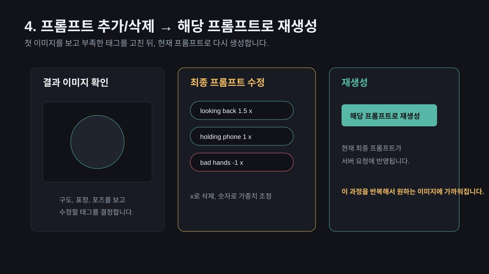
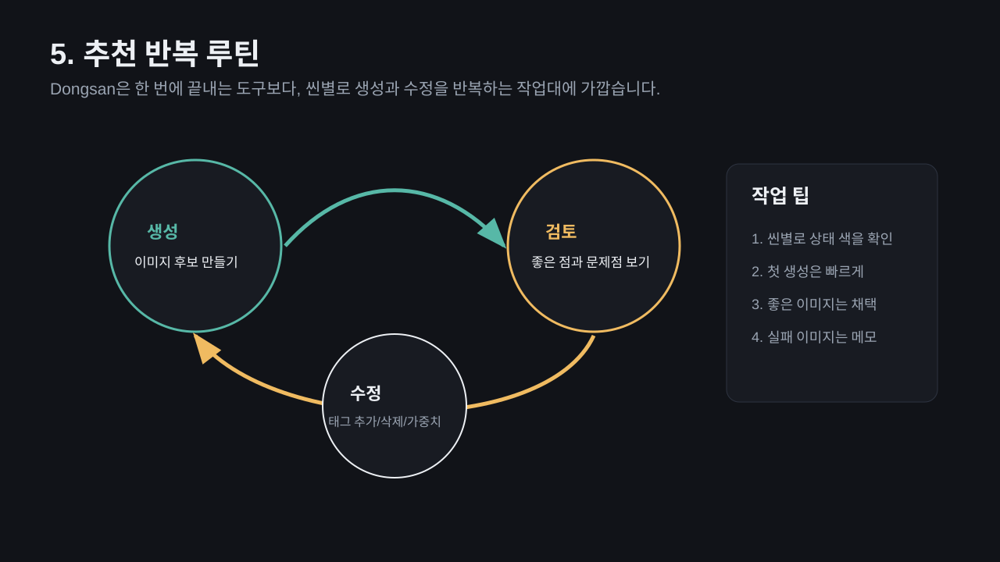

# Dongsan

Dongsan is an Electron desktop workbench for importing scene-description TXT files, drafting Danbooru-style tags, editing NovelAI prompts, generating images, and reviewing scene images.

## Preview



## Beginner Guide

처음 사용하는 사람은 아래 순서대로 따라 하면 됩니다.













More guide files are available in [docs/beginner-guide](docs/beginner-guide/README.md).

## Install

```bash
git clone https://github.com/dolwoo2234/image-dongsan.git
cd image-dongsan
npm install
npm start
```

On Windows, users can also double-click `run.bat`. It checks for Node.js/npm, installs dependencies when `node_modules` is missing, and then starts Electron.

NovelAI API keys are saved locally on each user's computer through Electron user data storage. They are not stored in this repository.

## Updates

Use GitHub Releases for published versions. The app can check the latest release from GitHub and, when a newer version exists, update itself with:

```bash
git pull --ff-only
```

After a successful update, Dongsan restarts automatically.

### v1.0.2

- Reworked the main layout into scene list, global/character presets, editor, and settings/gallery columns.
- Added character position controls for NovelAI character prompts.
- Made character prompt carry-over apply once and then turn off automatically when changing scenes.
- Added a scene generation cancel button.
- Changed NovelAI 429 retry handling to retry 8 times at 1-second intervals.
- Expanded Danbooru tag drafting for the NSFW Rena Sachon scene set.

### v1.0.3

- Made `run.bat` install dependencies automatically when Electron is missing.
- Added clearer Windows run instructions for cloned/downloaded copies.
